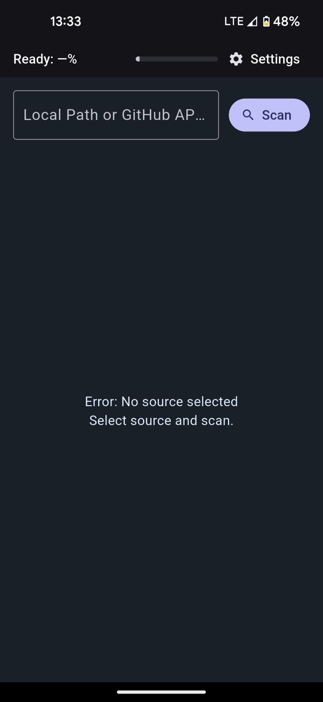
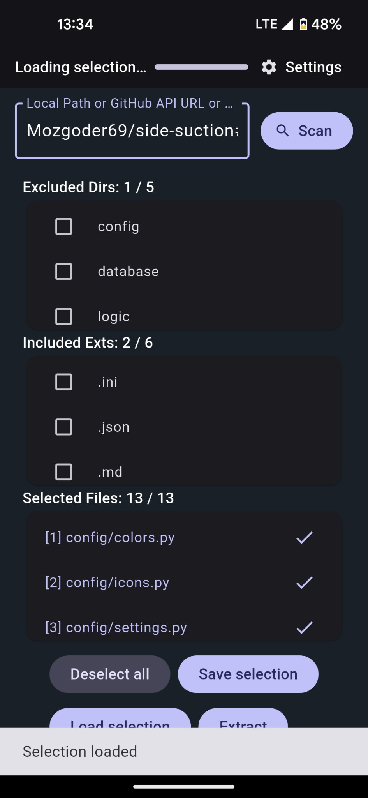
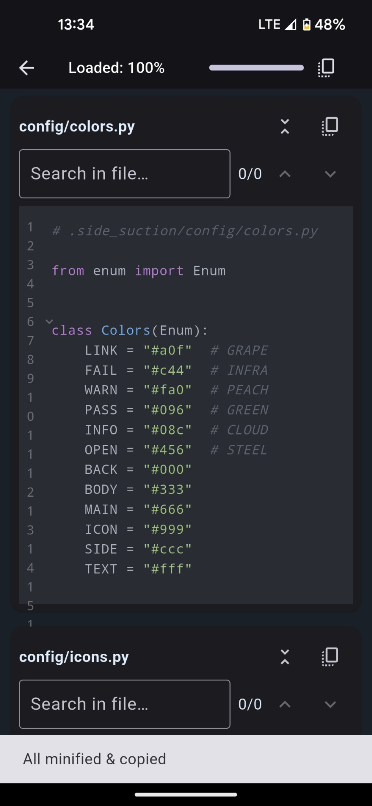
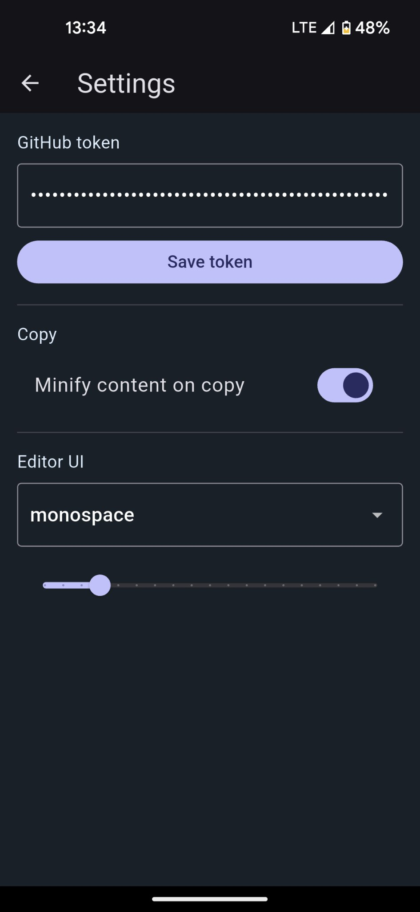

# Flutter Suction

Инструмент для быстрого просмотра исходников проекта (локально или из GitHub), фильтрации по директориям/расширениям, глобального поиска и копирования контента (с опцией минификации).

<p align="center">
  
  
  
  
</p>

## Возможности

- Загрузка дерева файлов:
  - Локальная папка.
  - GitHub репозиторий (`owner/repo[#branch]`) или прямая API‑ссылка `https://api.github.com/repos/.../git/trees/...`.
  - Поддержка усечённых деревьев GitHub (`truncated`) с догрузкой поддеревьев.
- Фильтрация:
  - Исключение директорий.
  - Включение расширений.
  - Нумерация выбранных файлов.
- Просмотр и копирование:
  - Подсветка синтаксиса (highlight).
  - Копирование одного файла или всех разом; опциональная минификация (убирает лишние переносы/пробелы, компактные HTML‑теги).
- Глобальный поиск по отфильтрованным файлам (счётчики совпадений, быстрый переход).
- Сохранение/загрузка “выборок” (директории, расширения, список файлов) в `ApplicationDocumentsDirectory`.
- Хранение GitHub token в защищённом хранилище (`flutter_secure_storage`).

## Требования

- Flutter ≥ 3.22
- Dart SDK ≥ 3.8
- Для GitHub API без токена действует жёсткий rate‑limit. Рекомендуется указать личный токен в настройках приложения.

## Быстрый старт

```bash
flutter pub get
dart run build_runner build --delete-conflicting-outputs
flutter run
```

## Формат источника
- Локальный путь: /path/to/project (Windows/MacOS/Linux)

- GitHub API URL: https://api.github.com/repos/<owner>/<repo>/git/trees/<sha_or_branch>?recursive=1

- GitHub кратко: owner/repo#branch (ветка по умолчанию main)

## Сборка релиза
```bash
# Android
flutter build apk --release

# Windows
flutter build windows
# macOS
flutter build macos
# Linux
flutter build linux
```

## Генерация кода
Проект использует freezed, json_serializable, riverpod_generator.

```bash
dart run build_runner build --delete-conflicting-outputs
```
